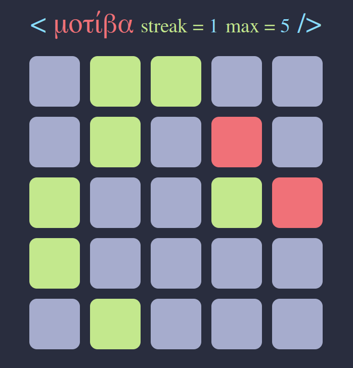
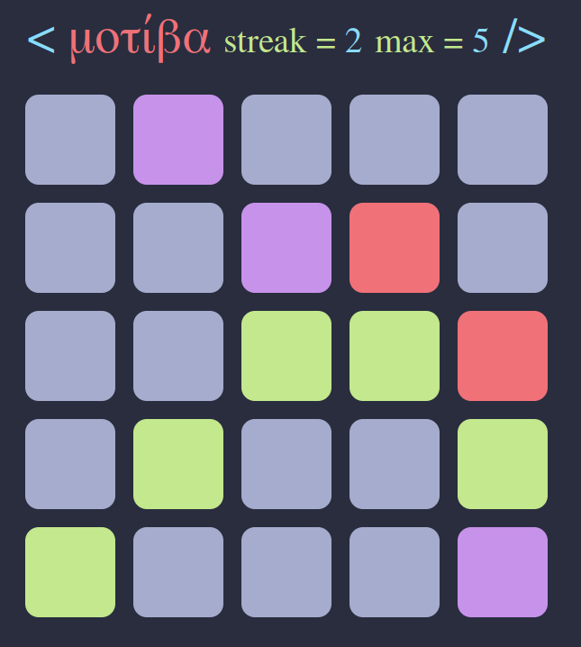

= mempat
:toc: left
:sectnums:
:toclevels: 3
:table-caption:
:linkattrs:
:experimental:

This is a simple game written in go using websockets and was just created to get familiar with different go 
concepts like go routines, channels, websockets and more.

== What it looks like

you can press the tiles and they turn around revealing wether they were correct or not.

when you lost it shows you what would have been correct instead.

== How to run

you need to install go with the version 1.22 after that you can just redirect to the server folder and start it.

[source, sh]
----
cd server
go run .
----

after doing that it is accessible on localhost:8080
